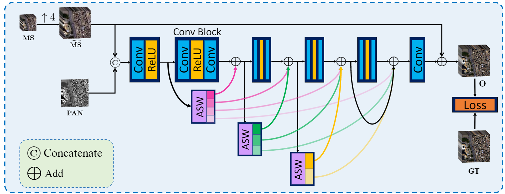
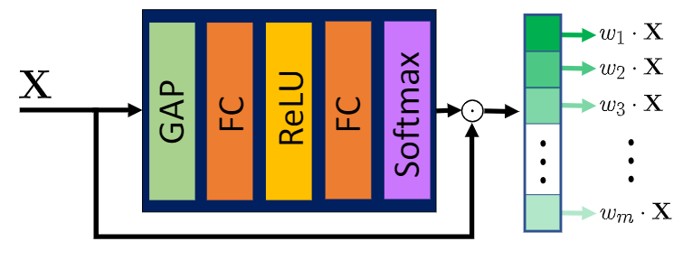
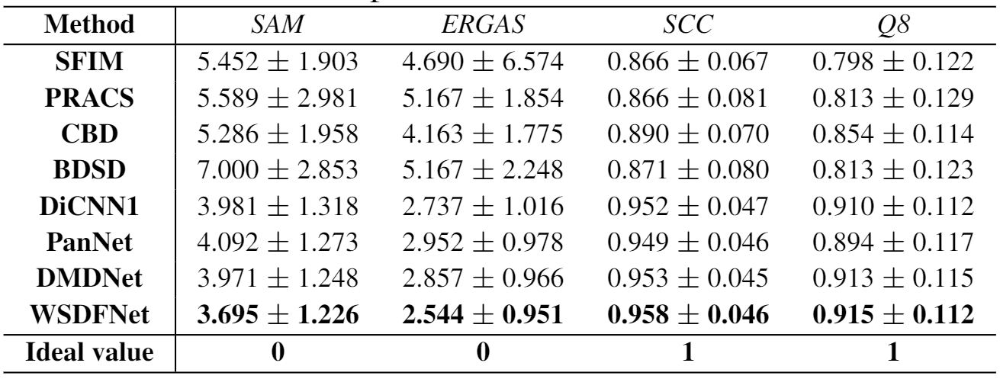
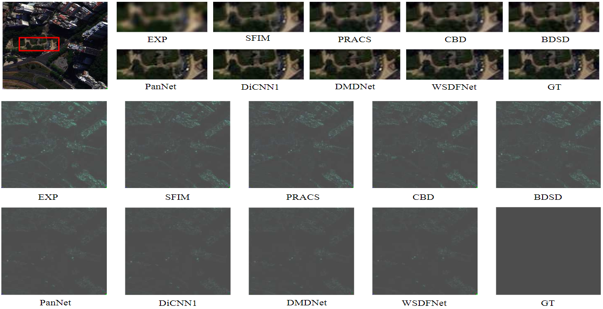

# Weighted Shallow-deep Feature Fusion Network for Pansharpening

Homepage:

https://liangjiandeng.github.io/

https://chengjin.netlify.app/

- Code for paper: "Weighted Shallow-deep Feature Fusion Network for Pansharpening"
- State-of-the-art pansharpening performance

# Dependencies and Installation
- Python 3.8 (Recommend to use [Anaconda](https://www.anaconda.com/))
- PyTorch > 1.1
- NVIDIA GPU + CUDA
- Python packages: `pip install numpy scipy h5py`
- TensorBoard

# Dataset Preparation
The datasets used in this paper is WorldView-3 (can be downloaded [here](https://www.maxar.com/product-samples/))). Due to the copyright of dataset, we can not upload the datasets, you may download the data and simulate them according to the paper.

# Get Started
Training and testing codes are in '[codes/](./codes)'. Pretrained model can be found in '[codes/pretrained/](./codes/pretrained)'. All codes will be presented after the paper is completed published. Please refer to `codes/how-to-run.md` for detail description.

# WSDF Architecture


ASW architecture is presented below:



# Results
### Quantitative results
The following quantitative results is generated from WorldView-3 datasets.



All quantitative results can be found in '[results/](./results)'.

### Visual Results
The following visual results is generated from WorldView-3 datasets.



# Citation
```bib
@INPROCEEDINGS{wsdfnet,
  author={Jin, Zi-Rong and Zhang, Tian-Jing and Jin, Cheng and Deng, Liang-Jian},
  booktitle={2021 IEEE International Geoscience and Remote Sensing Symposium IGARSS}, 
  title={Weighted Shallow-Deep Feature Fusion Network for Pansharpening}, 
  year={2021},
  volume={},
  number={},
  pages={2632-2635},
  doi={10.1109/IGARSS47720.2021.9555127}}
```

# Contact
We are glad to hear from you. If you have any questions, please feel free to contact [2018051403016@std.uestc.edu.cn](mailto:2018051403016@std.uestc.edu.cn) or open issues on this repository.

# License
This project is open sourced under GNU Affero General Public License v3.0.